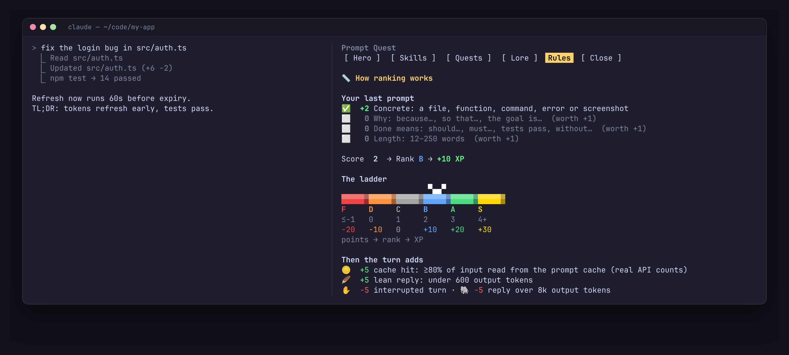

# 📖 Prompt Quest: Player's Guide

Everything about how the game works. For a quick look, run **`/quest rules`** in Claude Code. It shows the same rules with your last prompt broken down.

- [Getting started](#getting-started)
- [How a prompt is ranked](#how-a-prompt-is-ranked)
- [Turn bonuses and penalties](#turn-bonuses-and-penalties)
- [Levels, skill points and dormant skills](#levels-skill-points-and-dormant-skills)
- [The skill tree](#the-skill-tree)
- [Quests, streaks and lore](#quests-streaks-and-lore)
- [Tips and the Try rewrite](#tips-and-the-try-rewrite)
- [Fair play](#fair-play)
- [Commands](#commands)
- [Your data](#your-data)
- [Troubleshooting](#troubleshooting)

---

## Getting started

Run these one at a time, as three separate commands:

```text
/plugin marketplace add tomikng/prompt-quest
```

```text
/plugin install prompt-quest@prompt-quest
```

```text
/quest
```

If you use the **Add Marketplace** dialog in the `/plugin` menu, paste only `tomikng/prompt-quest` into it.

You start as a level 1 **Apprentice Wanderer** with one skill point. Work as usual: each prompt you type is ranked when the turn finishes, and the band above the prompt shows your level, XP and last rank.

## How a prompt is ranked



Ranking happens on your machine with simple rules. No model call is made and no tokens are spent. Each prompt is first sorted into one of three kinds.

### 1. Replies and short steering: always neutral

- **Replies:** a message of up to 8 words that starts with *yes, no, ok, sure, please, let's do it, sounds good…* and isn't a question. One-letter typos count too: `yeas pls`, `yse`, `oka`.
- **Short steering:** right after a turn, any message of 1–3 words (`next`, `go on`, `fix it`).

Examples: `yes`, `yes push them`, `yeas pls`, `no, keep the old name`.
→ **Rank C, 0 XP, no tips.** Steering Claude is never punished.

### 2. Questions: judged on clarity

A prompt that ends with `?` or starts with *where, what, how, why, is, can, does…*
You ask because you don't know, so a question **never** loses XP for a missing file, reason or finish line.

| Question | Rank | XP |
| --- | --- | --- |
| Points at a file, error text or screenshot | ⭐ A | +20 |
| Clear question | 💎 B | +10 |
| One or two words ("why?") | ⚪ C | 0 |

### 3. Tasks: scored on agentic habits

Everything else is a task. The signals reward what works with coding agents: point at the code, say why, and give Claude a way to know it's done and to check its work.

| Signal | Points | Counts when the prompt has… |
| --- | --- | --- |
| **Concrete** | +2 | a path (`src/auth.ts`), a code span in backticks, a `function()`, a line number (`:42`), an `@file` mention, a URL, or a screenshot |
| **Follow-up** | +1 | no file named, but you're mid-session (a turn in the last 30 min) and the prompt is 40 words or fewer. It builds on the task in progress, so you don't need to repeat yourself. |
| **Why** | +1 | *because, so that, the goal is, I need, users can't…* |
| **Done means** | +1 | *should, must, until, returns, instead of, done when…* |
| **Verifiable** | +1 | *run the tests, tests pass, verify, check that, lint, typecheck, screenshot, curl…* |
| **Scoped** | +1 | *only, don't, without, keep, avoid, no new, at most…* |
| **Plan first** | +1 | *propose a plan, options, trade-offs, before editing, ask me, think it through…* |
| **Example** | +1 | *e.g., for example, such as*, or a code block |
| **Length** | +1 | 12–600 words |
| Vague and tiny | −2 | under 8 words *and* "fix it", "doesn't work", "help"… (not counted mid-session) |
| Too terse | −1 | under 4 words (not counted mid-session) |
| Wall of text | −1 | over 800 words with no headings, bullets or code block |

Then the points map to a rank:

```text
 points   ≤ −1    0     1     2    3–4    5+
 rank      F     D     C     B     A     S
 XP       −20   −10    0    +10   +20   +30
```

**S needs 5+ points.** A clear, anchored prompt with a reason reaches A; the top rank also takes a habit that makes agentic work go well: verification, scope, a plan or an example.

**Anti-stuffing rule:** a task under 8 words is capped at **B**, even if it hits every signal.

#### Worked examples

| Prompt | Signals | Points | Rank |
| --- | --- | --- | --- |
| `fix it` (new session) | vague and tiny | −2 | 💀 F (−20) |
| `fix it` (right after a turn) | short steer | — | ⚪ C (0) |
| `login is broken` | too terse (3 words) | −1 | 💀 F (−20) |
| `fix the login bug in src/auth.ts` | concrete | 2 | 💎 B (+10) |
| `now do the same for the signup page, tests should pass` (mid-session) | follow-up, done, verifiable | 3 | ⭐ A (+20) |
| `fix the login bug in src/auth.ts because users get logged out after 5 minutes` | concrete, why, length | 4 | ⭐ A (+20) |
| `Fix the token refresh in src/auth.ts because users get logged out. Only touch that file, then run npm test to verify.` | concrete, why, scoped, verifiable, length | 6 | 👑 S (+30) |
| `Propose a plan before editing: we need rate limiting on /api/login because of brute force. Keep the public API the same and run the tests.` | concrete, why, plan, scoped, verifiable, length | 7 | 👑 S (+30) |

## Turn bonuses and penalties

When the turn ends, Prompt Quest reads the turn's **real token counts as reported by the API** (Claude Code passes them to the plugin), added up over every request in the turn:

| Event | XP | Measured how |
| --- | --- | --- |
| 🪙 Cache hit | +5 | cache-read tokens ÷ all input tokens ≥ 80%, in a turn with over 2,000 input tokens |
| 🪶 Lean reply | +5 | under 600 output tokens in a turn with no file edits (code changes are the work, so they're never counted against you) |
| ✋ Interrupted turn | −5 | you stopped the turn |
| 🗺 Plan mode | +5 | Claude entered or left Plan mode this turn, so it planned before changing anything |
| 🐘 Heavy output | −5 | over 8,000 output tokens in a turn with no file edits |
| 🧹 Clean Slate | +10 | you ran `/clear` while carrying 50k+ tokens of history |
| 🔀 Cache break | tip only | the model changed since the last turn and the cache went cold (no XP lost, since `opusplan` switches on purpose) |

Prompt XP is only awarded for a **real turn**, one where Claude Code reports API usage.

## Levels, skill points and dormant skills

- Level *L* needs **100 + 50 × (L − 1)** more XP: 100 for level 2, 150 more for level 3, and so on.
- Each level gives one **skill point**. You start with one.
- XP can go **down**, and so can your level. When you lose XP the hero takes a hit: a fireball, a damage number, and the lost XP blinking red on the bar.
- If your level falls below the number of skills you've learned, your **newest skills go dormant 💤** until you climb back.

Titles: Apprentice (1–2) · Adept (3–5) · Expert (6–8) · Master (9–11) · Archmage (12+).
Your **class** follows the branch where you've learned the most skills: 🧭 Wanderer (none yet), 🪶 Scribe, 🧪 Alchemist, 🔮 Sage.

## The skill tree

Skills unlock top to bottom within a branch. **Perks** (marked ✍️) add a short instruction to Claude's system prompt and can be switched on or off. Switching one makes the prompt cache rebuild once.

### 🪶 Scribe: read output better

1. ✍️ **TL;DR Rune**: replies end with a one-line TL;DR.
2. ✍️ **Glossary Lens**: jargon gets a short inline definition the first time it appears.
3. ✍️ **Why-Trace**: every change comes with the reason before the what.
4. ✍️ **Answer-First**: lead with the answer, then the details; a table for comparisons.

### 🧪 Alchemist: spend tokens wisely

1. **Coin Purse**: a token ledger above the prompt after each turn.
2. **Cache Sight**: warns when the cache has probably gone cold (more than 5 idle minutes; this one is an estimate).
3. ✍️ **Terse Tongue**: concise replies, fewer output tokens.
4. **Budget Ward**: a session output budget (`/quest budget 50k`) with alarms at 50%, 80% and 100%.

### 🔮 Sage: learn the world of AI

1. **Oracle Quiz**: a quiz on every lore card, +25 XP for a right answer.
2. **Deep Archives**: the advanced deck (KV cache, RLHF, Constitutional AI, MoE, speculative decoding, RAG, scaling laws, interpretability, MCP, agents, quantization, evals).
3. ✍️ **Concept Spotter**: when a reply involves an AI concept, Claude adds a one-line "📜 Lore:" note.
4. **Oracle's Eye**: `/quest oracle <topic>` makes a new lore card on any topic with a small Haiku call.

## Quests, streaks and lore

- **Daily quests:** three a day, chosen from *Sharpshooter* (3 prompts ranked A/S), *Cache Keeper*, *Scholar*, *Lean Blade*, *Quiz Champion*, *Journeyman*, *Why Seeker* and *Clean Slate* (`/clear` after a long conversation). +50 XP each.
- **Streak:** use Prompt Quest on consecutive days. Shown as 🔥 Nd.
- **Lore:** three decks. "Learned" gives +15 XP once per card.
  - 📖 **Foundations** (12 cards): tokens, context, caching, sampling and more.
  - 🛠 **Claude Code Internals** (7 cards): what each request carries, what breaks the cache, planning vs. execution models, adaptive thinking and effort, why `/clear` saves money, auto-compact, and CLAUDE.md.
  - 🏛 **Deep Archives** (12 cards, unlocked by the Sage skill).

## Tips and the Try rewrite

After a weak prompt the band shows:

```text
🎯 Missing: [which file] [why] [what done means]   (4 tips: /quest)
✏️ Try: login is broken in `src/auth.ts`, because <why>, done when `npm test` passes.
```

Tips use **what actually happened in the turn**: the file Claude edited or read most, how many reads and searches it took to find it, and the test or check command Claude ran. The *why* stays a placeholder because only you know it. Turn tips cover heavy output, a cold cache, many tool calls and a large context.

## Fair play

Ranking runs on your own machine, so it's a game against yourself: a determined player can always edit their copy. The rules still make gaming them pointless:

- Repeating a prompt earns **0 XP**. Only a hash of each recent prompt is kept, never the text.
- Tasks under 8 words are capped at B, so keyword stuffing ("fix `a.ts` because should") doesn't pay.
- Prompt XP needs a real turn with real API usage reported by Claude Code. Typing a number into a prompt can't fake it.

**Prompt injection:** the grader is plain pattern matching, not a model, so there is nothing to talk into anything. The perks are fixed text written by the plugin, and nothing a user types reaches the system prompt.

Found a way to game it? Please [open an issue](https://github.com/tomikng/prompt-quest/issues/new?template=rank-feedback.yml).

## Commands

| Command | What it does |
| --- | --- |
| `/quest` | Open the pane (tabs Hero, Skills, Quests, Lore, Rules on keys `1`–`5`) |
| `/quest rules` (or `help`) | Show how ranking works, with your last prompt broken down |
| `/quest skills` · `quests` · `lore` | Open a specific tab |
| `/quest close` | Close the pane (or press **Close** / `x`) |
| `/quest band` | Show or hide the status band |
| `/quest budget 50k` | Set the session output budget |
| `/quest oracle <topic>` | A new lore card from Haiku |
| `/quest feedback [--prompt] <why>` | Report a rank that felt wrong (a pre-filled GitHub issue) |
| `/quest idea <text>` | Suggest an improvement |
| `/quest reset confirm` | Start over at level 1 |

## Your data

- Progress lives in one JSON file: `~/.claude/plugins/store/prompt-quest*.json`.
- Prompt text is never saved. The last prompt is held in memory for this session only, for the optional *Report with my prompt*.
- The plugin makes no network calls of its own. `/quest oracle` goes through Claude Code to Haiku, and feedback only opens a link in your browser.

## Troubleshooting

| Problem | Fix |
| --- | --- |
| Symbols overlap or smear | Use a font with good emoji support. The plugin avoids ambiguous-width symbols, but some fonts still draw emoji wide. |
| No pixel art | Pixel art draws only in the terminal. Desktop and other surfaces get text. |
| The pane doesn't open beside the transcript | It docks at 144+ columns. Narrower terminals show it inline. |
| A rank felt wrong | Press **Report** on the Hero tab. It opens a pre-filled issue; nothing is sent until you press Submit. |
