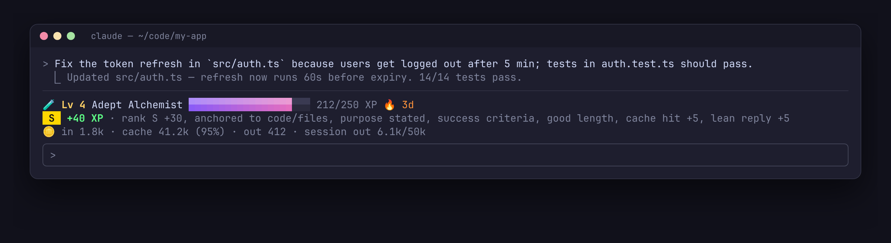
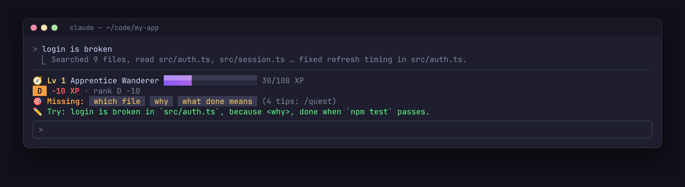
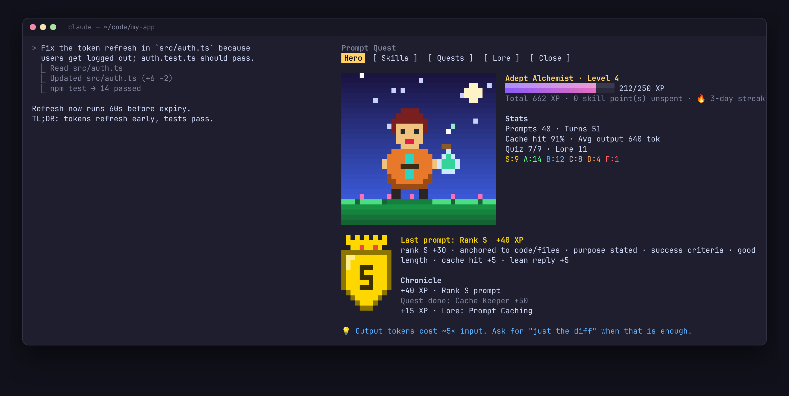
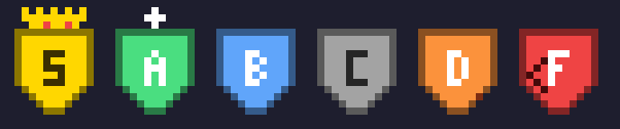
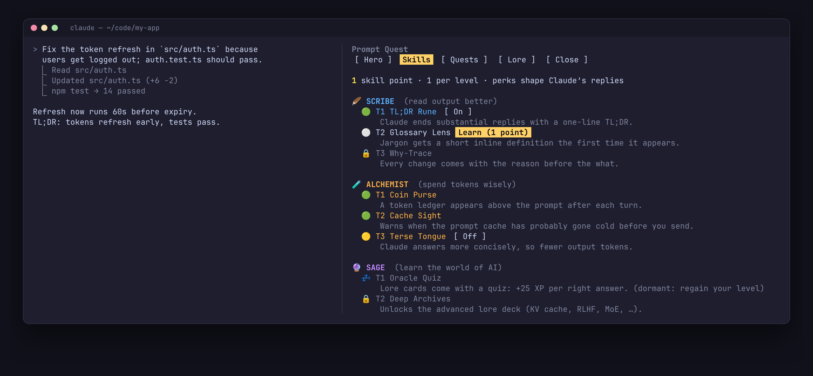

<div align="center">


# ⚔️ Prompt Quest

**An RPG layer for [Claude Code](https://claude.com/claude-code).**
Level up by writing sharper prompts, spending tokens wisely and learning how modern AI works.

[](.claude-plugin/marketplace.json)
[](https://claude.com/claude-code)
[](LICENSE)
[](#privacy)
[](https://github.com/tomikng/prompt-quest/stargazers)

[Install](#install) · [How it plays](#how-it-plays) · [Skill tree](#skill-tree) · [Commands](#commands) · [FAQ](#faq)

</div>

---

## Why

Most wasted tokens come from vague prompts: Claude has to search for the file you meant, guess what "done" looks like, and write long answers you skim. Prompt Quest turns the habits that fix this into a game you play while you work:

- 🎯 **Every prompt gets a rank, S to F.** Name the file, say why, say what done means: you climb. "fix it": you fall.
- 💡 **Tips built from what actually happened.** "Next time point to `src/auth.ts` directly. Claude made 6 reads to find it."
- 🪙 **Token sense.** Cache hits, lean replies and a session budget, shown live above your prompt.
- 📜 **AI lore.** 24 cards with quizzes, from tokens and caching to RLHF, Constitutional AI, MoE and interpretability.
- 🎨 **Animated pixel art.** Your hero cheers when you level up, takes a fireball when a prompt ranks badly, and sulks in the rain after.

## See it

**A sharp prompt** earns XP, with a live token ledger:



**A vague prompt** costs XP and tells you exactly what to add, with your own prompt rewritten:



**`/quest`** opens the side pane with your hero, stats, last rank and chronicle:



<table>
<tr>
<td width="50%" align="center"><br><sub>Idle → level up ✨ → hit by a bad prompt 💥 → downcast 🌧</sub></td>
<td width="50%" align="center"><br><sub>Rank badges S · A · B · C · D · F</sub></td>
</tr>
</table>

<sub>The pixel art above is rendered by the plugin's own drawing code (<code>scripts/render-assets.sh</code>). The terminal frames are faithful recreations of the plugin's layout and colors.</sub>

## Install

```text
/plugin marketplace add tomikng/prompt-quest
/plugin install prompt-quest@prompt-quest
```

Then type **`/quest`**.

> [!NOTE]
> Requires Claude Code **2.1.289+** (function-hook plugins, an early-access API).
> Pixel art draws in the terminal. Other surfaces get a text version.
> The side pane docks beside the transcript when the terminal is at least 144 columns wide.

Update later with `claude plugin update prompt-quest@prompt-quest`.

## How it plays

### Prompt ranks

Each prompt you type is graded on your machine with simple heuristics. No model call, no tokens.

| What your prompt has | Points |
| --- | --- |
| Something concrete: a file, function, command, error text, or a screenshot | +2 |
| A reason: *because…*, *so that…*, *the goal is…* | +1 |
| A finish line: *should*, *must*, *tests pass*, *without…* | +1 |
| A sensible length (12–250 words) | +1 |
| Vague and tiny ("fix it", "doesn't work") | −2 |

| Rank | 👑 S | ⭐ A | 💎 B | ⚪ C | 🔻 D | 💀 F |
| --- | --- | --- | --- | --- | --- | --- |
| XP | +30 | +20 | +10 | 0 | −10 | −20 |

**Questions are graded differently.** You ask because you don't know, so a question is never penalized for not naming a file, a reason or a finish line. A clear question is 💎 B (+10), and one grounded in a file, an error or a screenshot is ⭐ A (+20). Replies to Claude like "yes", "yes push them" or "no, keep it" are neutral.

### Turn bonuses

| Event | XP |
| --- | --- |
| Cache hit ≥ 80% | +5 |
| Reply under 600 output tokens | +5 |
| Interrupted turn | −5 |
| Reply over 8k output tokens | −5 |
| Lore card read · quiz answered right · daily quest done | +15 · +25 · +50 |

### Levels go both ways

XP can drop below a level threshold. If you fall below the number of skills you've learned, your newest skills go **dormant 💤** until you climb back.

### Concrete tips

After every turn, Prompt Quest looks at what Claude actually did, including files read and edited, searches run and test commands used, and turns it into advice:

- 🎯 **Missing:** chips showing which part your prompt lacked
- ✏️ **Try:** your prompt rewritten with the real file and the real check filled in
- 🪙 Token tips: heavy output, a cold cache, too many tool calls, a context getting large

## Skill tree

One skill point per level. Tiers unlock in order within a branch. Perks that change Claude's replies can be toggled on and off.



| Tier | 🪶 Scribe *(read output better)* | 🧪 Alchemist *(spend tokens wisely)* | 🔮 Sage *(learn AI)* |
| --- | --- | --- | --- |
| 1 | **TL;DR Rune**: replies end with a one-line TL;DR | **Coin Purse**: token ledger above the prompt | **Oracle Quiz**: quizzes on lore cards |
| 2 | **Glossary Lens**: jargon defined inline | **Cache Sight**: warns when the cache has gone cold | **Deep Archives**: the advanced lore deck |
| 3 | **Why-Trace**: the reason before every change | **Terse Tongue**: concise replies, fewer output tokens | **Concept Spotter**: a "📜 Lore:" note when an AI concept comes up |
| 4 | **Answer-First**: lead with the result | **Budget Ward**: session budget with 50/80/100% alarms | **Oracle's Eye**: `/quest oracle <topic>` conjures new cards |

Your class (and your hero's look) follows the branch you've invested in most.

## Commands

| Command | What it does |
| --- | --- |
| `/quest` | Open the pane (tabs Hero, Skills, Quests, Lore on keys `1`–`4`) |
| `/quest skills` · `quests` · `lore` | Open a specific tab |
| `/quest close` | Close the pane (or press **Close** / `x`) |
| `/quest band` | Show or hide the status band above the prompt |
| `/quest budget 50k` | Set the session output-token budget (Budget Ward) |
| `/quest oracle <topic>` | New lore card via a small Haiku call (Oracle's Eye) |
| `/quest feedback [--prompt] <why>` | Report a rank that felt wrong (opens a pre-filled GitHub issue) |
| `/quest idea <text>` | Suggest an improvement |
| `/quest reset confirm` | Start over at level 1 |

## Feedback makes it smarter

The grading rules are simple heuristics, and they improve through your reports. If a rank feels wrong, press **Report** under *Last prompt* in the Hero tab, or run `/quest feedback <why>`.

- A **pre-filled GitHub issue** opens in your browser with the rank, the signals the grader saw and your comment. Nothing is sent until you press **Submit**.
- Your prompt text is included **only** if you choose *Report with my prompt* (or `--prompt`).
- Your first report each day earns **+10 XP**.

Ideas go through `/quest idea <text>`. All reports land in [Issues](https://github.com/tomikng/prompt-quest/issues), labeled `rank-feedback`, `enhancement` or `bug`.

## Privacy

- Prompt grading and tips run locally, with no network calls.
- Progress is saved in the plugin's own store, a JSON file under `~/.claude/plugins/store/`.
- The only model call is the optional `/quest oracle`, which uses a few hundred Haiku tokens.
- Feedback only opens a browser link. You review and submit the issue yourself.

## FAQ

**Does it change how Claude behaves?** Only if you learn and enable a perk (TL;DR Rune, Terse Tongue and so on). Perks add a short section to the system prompt, and toggling one rebuilds the prompt cache once.

**Will it cost me tokens?** No, apart from the optional Oracle. Perks like Terse Tongue usually *save* tokens.

**Can I hide it?** `/quest close` closes the pane and `/quest band` hides the status band.

## Development

```bash
claude --plugin-dir ./plugins/prompt-quest      # run it from source
claude plugin validate ./plugins/prompt-quest   # check the manifest and hooks
claude plugin test ./plugins/prompt-quest       # run the tests
./scripts/render-assets.sh                      # regenerate README images
```

```text
plugins/prompt-quest/
├── hooks/register.tsx   # hooks, pane, status band, animation loop
├── hooks/data.ts        # skills, ranking rules, tips, quests, lore
├── hooks/art.ts         # pixel art: hero scenes, rank badges, bars
├── types/index.d.ts     # state contract
└── tests/
```

Issues and PRs are welcome, especially new lore cards and pixel art.

## License

[MIT](LICENSE) © tomikng
